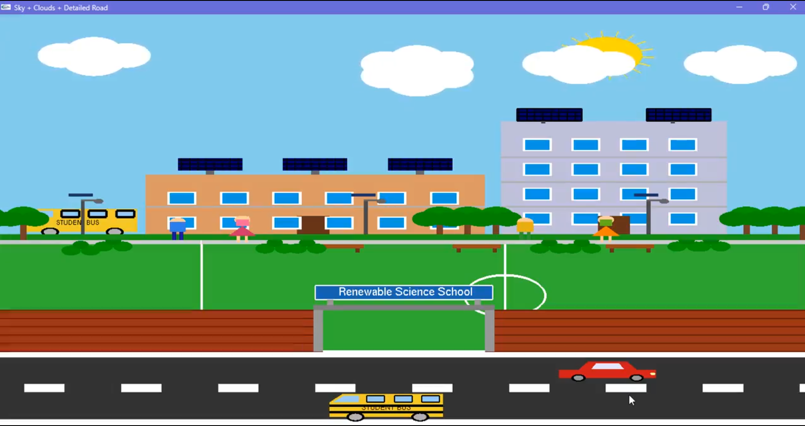
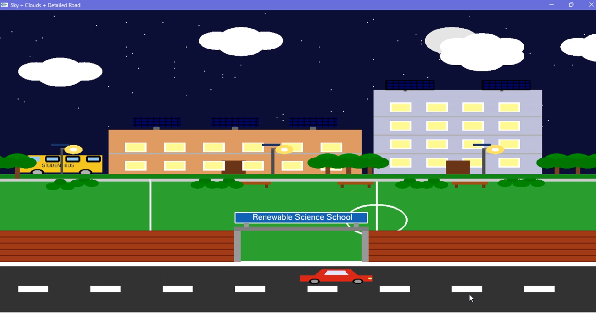

# 🏫 Renewable Science School

An interactive computer graphics project developed using **OpenGL (GLUT)** in **Code::Blocks**. The project presents a visual environment of a Renewable Science School with moving vehicles and interactive controls.

## 🛠️ Technologies
- C++
- OpenGL
- GLUT
- Code::Blocks

## ✨ Features
- 🏫 Renewable Science School environment
- 🚗 Moving cars
- 🚌 Moving buses
- 🖱️ Left-click to increase vehicle speed
- 🖱️ Right-click to stop vehicles
- 🌙 Press `N` to activate Night Mode
- ☀️ Dynamic Day-to-Night visual experience
- 🎮 Interactive graphics using keyboard and mouse

## 🚀 How to Run
1. Open the project in **Code::Blocks**.
2. Make sure OpenGL and GLUT are configured.
3. Build and run the project.
4. Use the mouse and keyboard controls to interact with the scene.

## 📸 Screenshot

  
  

## 👩‍💻 Author
**Most. Ashifa Tamanna**
